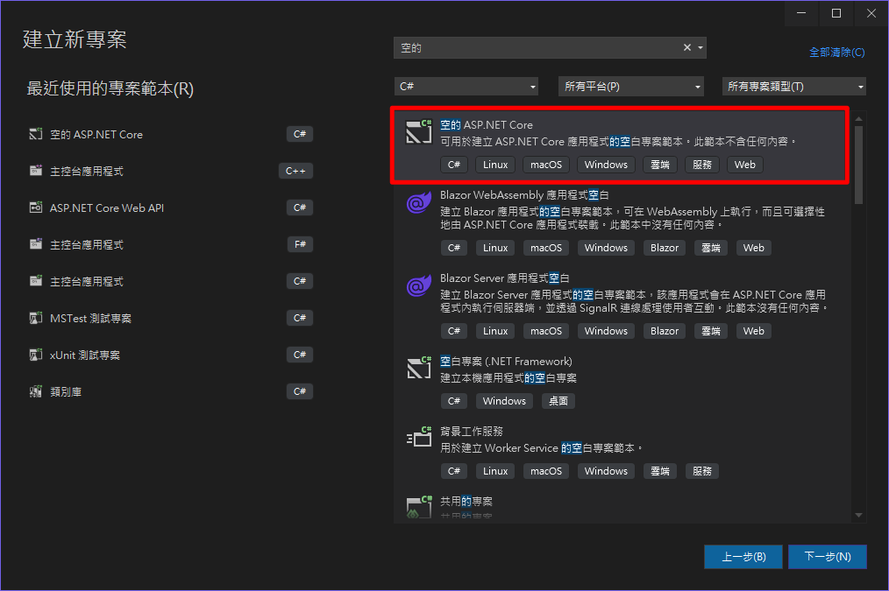

# MinimalAPI.NET8
Minimal API .NET 8 的測試專案

# 建立 Minimal API 專案

- 選擇【空的 ASP.NET Core】專案
- 打開 Program.cs 可以見到 Minimal API 的預設寫法
```
var builder = WebApplication.CreateBuilder(args);
var app = builder.Build();

app.MapGet("/", () => "Hello World!");

app.Run();
```
# 啟動
http://localhost:5000

